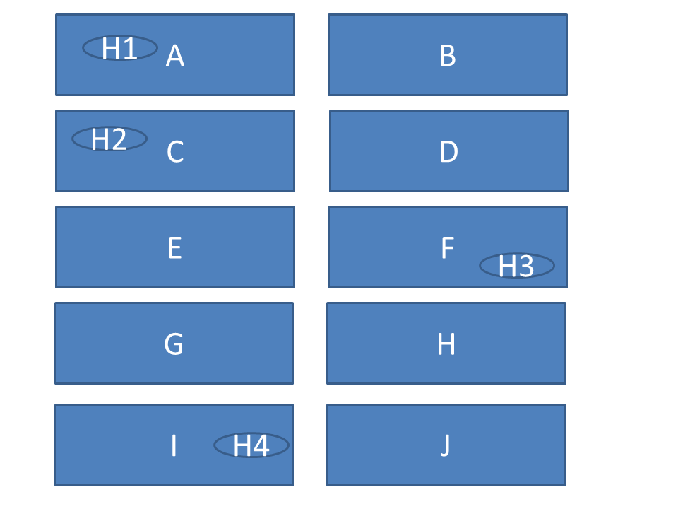

# Description of the case

## Background

We have a region that consists of ten zipcodes (A to J) with four active hospitals. Each zipcode contains 200 patients. The competition authority wants to know if there are any hospitals in this market that possess market power. The competition authority considers a logit competition (LOCI) of 0.45 or lower as a very strong indication of market power. Note that a hospital with a LOCI of 0.45 corresponds to having on average a 55% marketshare in his micromarkets. The Dutch healthcare Authority considers such marketshare [to be troublesome in theory](https://puc.overheid.nl/PUC/Handlers/DownloadDocument.ashx?identifier=PUC_12602_22&versienummer=1&type=pdf&ValChk=BpXjQ5cfMdMAtJ9mXWwhX8UtcJrYTwhXkmeb1fKvw5g1). (Please note this is in Dutch, not really neccesary for the assignment)

Use the data on patients’ choices (hospitaldata.csv) to calculate the LOCI. Firstly, calculate the LOCI based on observed choices and, secondly, calculate the LOCI based on predicted choices. For the latter you need to estimate a logit choice model. You can use the script from Ramsis Croes (lecture 5). Remark: you need to modify the script.  

Schematic description of the market:

## data description

- PatientID   : patient's id
- zipcode     : patient's zipcode (A...J)  
- gender      : patient’s gender, male = 1, female = 0 
- age65       : patient’s age, if age> 65 then age65=1, otherwise age65=0
- alternative : patient's hospital alternatives (1...4) 
- time        : traveltime from patient's zipcode to the hospital alternative in minutes
- choice      : choice=1 if the patient has chosen this alternative, otherwise choice=0

## Background market
In this market, similarly to the actual Dutch hospital market, consumers buy health insurance from health insurers and health insurers negotiate prices with hospitals. 

## Assignment

You work for the competition authority. Is there any indication of hospitals possessing market power in this market?  If this is the case, what could be an effective remedy to reduce the risk that these hospitals abuse their market power? An abuse could be that the hospital charges prices to the insurer that are way higher than the competitive prices (hint: lecture 3!).

We ask you to mail your answers in the form of a notebook (in the form of Rmd AND knitted to pdf or html) to

m.c.mikkers@tilburguniversity.edu

Before November 9, 2022, 18.00 hours.

You are allowed to work in groups of a maximum of 2 students.

For questions please use the discussion forum on Canvas

